# 2420_assign2

## Establish Server Connection

### Author

+ **Nai Yen Lin**
  + *A01320713*


## Step 1

Create **Digital Ocean** infracture.

Create **VPC** in DO, make sure the parameters are set.

Here is the piciture of the button to create a new **VPC**.
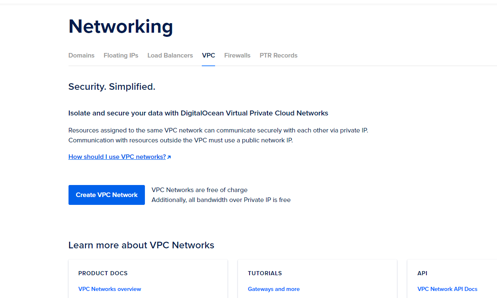

Make sure you have set the name of **VPC** before creating one.


Create at least **2 droplets** with following parameters set.

Click the button to create new droplet.
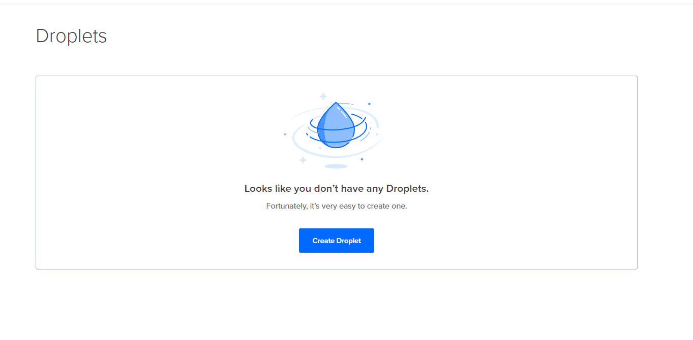

Don't forget to add tag to new droplets.
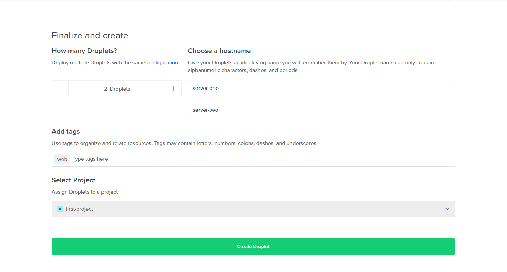


Create **Load Balancer** with following parameters set.

Click the button to create load balancer.
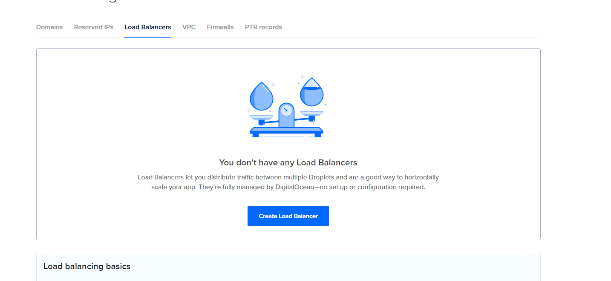

Click **droplets** to your load balancer by **tag**.
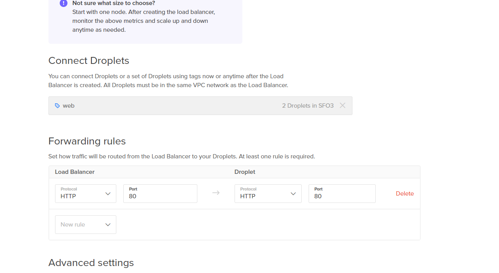

Don't forget to name your new load balancer.
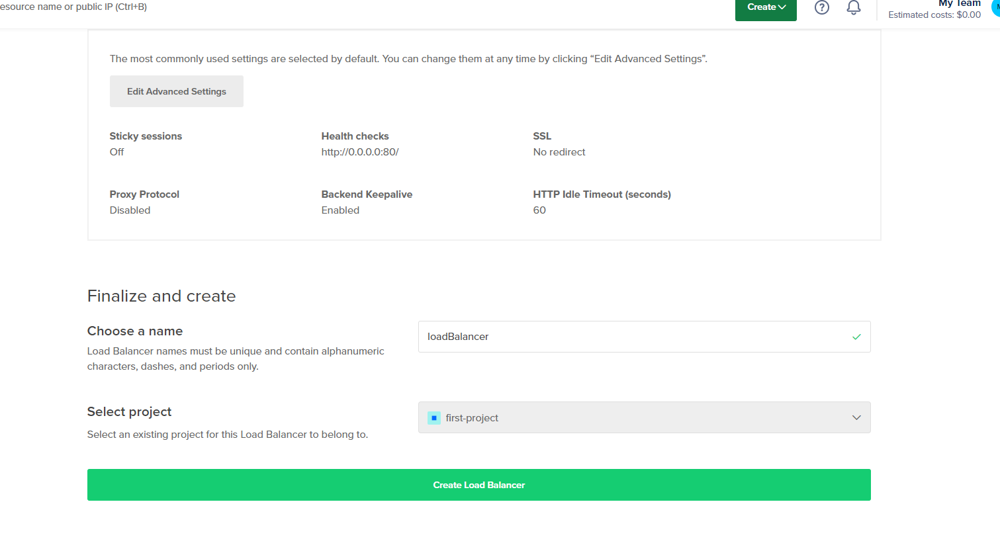


Create **Firewall** with following parameters set.

Click the button to create firewall.
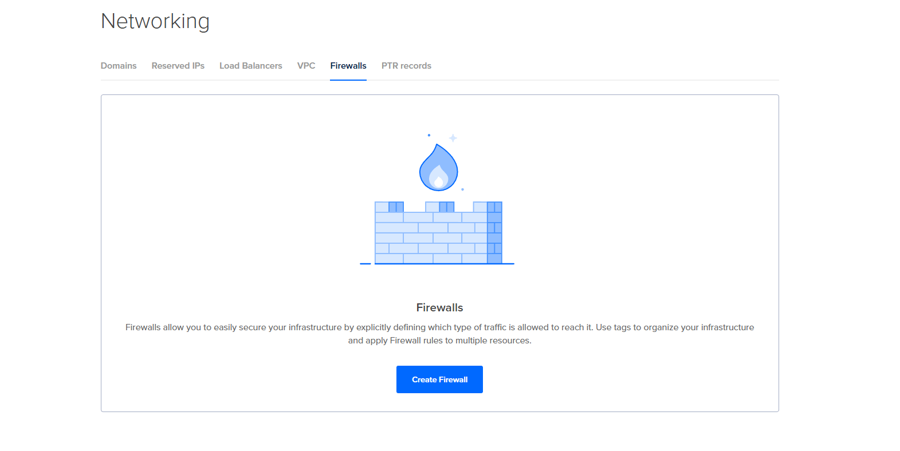

Set the inbound rule for firewall. Create a new **HTML** rule, and input your **name of load balancer** in the rule. 
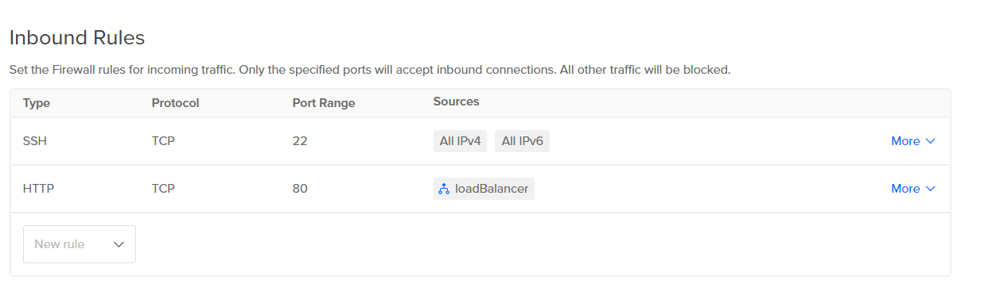

Apply **droplet tag** before the completion of firewall.
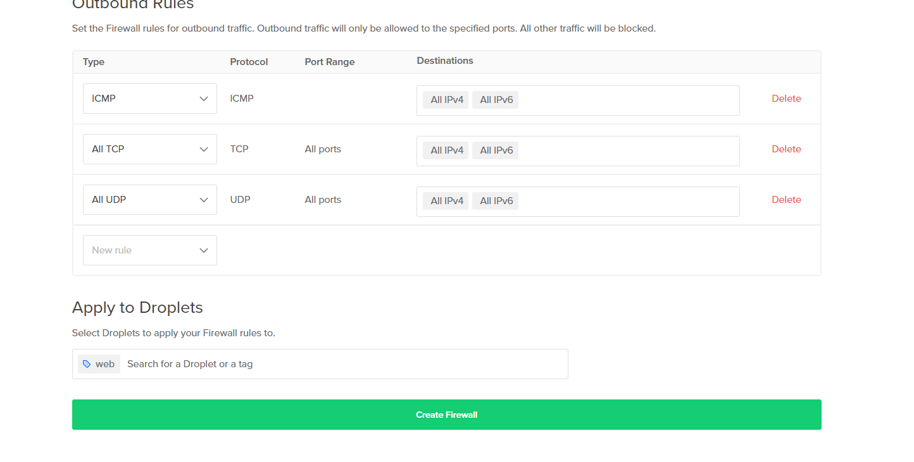


## The following steps are performed mirrorly on both servers.


## Step 2

Create a **user**.

Here is sample code shall look like.  
  ```bash
    useradd -ms /bin/bash <name>
    usermod -aG sudo <name>
    rsync --archive --chown=<name>:<name> ~/.ssh /home/<name>
    passwd <name>
  ```

Screenshots of command are provided below.
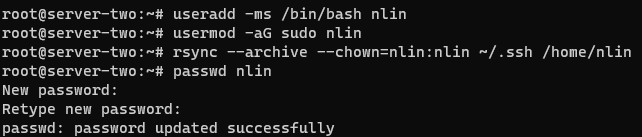


## Step 3

Install **Caddy**.

Here is sample code to create the file.  
  ```bash
    sudo apt install -y debian-keyring debian-archive-keyring apt-transport-https
    curl -1sLf 'https://dl.cloudsmith.io/public/caddy/stable/gpg.key' | sudo gpg --dearmor -o /usr/share/keyrings/caddy-stable-archive-keyring.gpg
    curl -1sLf 'https://dl.cloudsmith.io/public/caddy/stable/debian.deb.txt' | sudo tee /etc/apt/sources.list.d/caddy-stable.list
    sudo apt update
    sudo apt install caddy
  ```

## Step 4

Create website files to upload.

Create a new directory call **html**.
  ```bash
    mkdir html
  ```
Create a **html file** called **index.html**.
  ```bash
    vim html/index.html
  ```

Here is the content written in index.html.
  ```html
    <!DOCTYPE html>
    <html lang="en">
    <head>
        <meta charset="UTF-8">
        <meta http-equiv="X-UA-Compatible" content="IE=edge">
        <meta name="viewport" content="width=device-width, initial-scale=1.0">
        <title>My Website</title>
    </head>
    <body>
        <h1>This is [Author]'s Website on Server [one or two]</h1>
    </body>
    </html>
  ```

Create a new directory call **src**, and go to the newly created directory.
  ```bash
    mkdir src
    cd src
  ```

Create new **node** project inside **src**, and installation of **fastify** will then be performed here.
  ```bash
    npm init
    npm i fastify
  ```

Create a **javascript** file called **index.js** in **src**.
  ```bash
    vim index.js
  ```

Here is the content written in index.js, you will add host and change port.
  ```javascript
    // Require the framework and instantiate it
    const fastify = require('fastify')({ logger: true })

    // Declare a route
    fastify.get('/api', async (request, reply) => {
    return { hello: 'Server [one or two]' }
    })

    // Run the server!
    const start = async () => {
    try {
        await fastify.listen({ port: 5050, host: '127.0.0.1' })
    } catch (err) {
        fastify.log.error(err)
        process.exit(1)
    }
    }
    start()
  ```


## Step 5

Write the **Caddyfile** 

Codes are provided to access the file.
  ```bash
    sudo vim /etc/caddy/Caddyfile
  ```

Modify the contents in caddy file, indicates **its port** and **where html file is located**.
  ```bash 
    # The Caddyfile is an easy way to configure your Caddy web server.
    #
    # Unless the file starts with a global options block, the first
    # uncommented line is always the address of your site.
    #
    # To use your own domain name (with automatic HTTPS), first make
    # sure your domain's A/AAAA DNS records are properly pointed to
    # this machine's public IP, then replace ":80" below with your
    # domain name.

    http:// {
            # Set this path to your site's directory.
            root * /var/www/html

            reverse_proxy /api localhost:5050

            # Enable the static file server.
            file_server

            # Another common task is to set up a reverse proxy:
            # reverse_proxy localhost:8080

            # Or serve a PHP site through php-fpm:
            # php_fastcgi localhost:9000
    }

    # Refer to the Caddy docs for more information:
    # https://caddyserver.com/docs/caddyfile
  ```

Screenshot is avaliable.
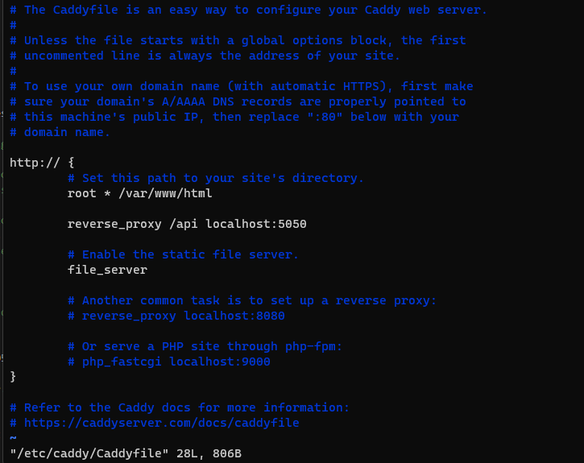

Don't forget to give permission to execute Caddyfile.
  ```bash
    sudo chown caddy:caddy /etc/caddy/Caddyfile
    sudo chmod 660 /etc/caddy/Caddyfile
  ```


## Step 6

Install **node** and **npm** with **Volta**.

Codes are provided.
  ```bash
    curl https://get.volta.sh | bash
    source ~/.bashrc
    volta install node
    which npm
    volta install npm
  ```


## Step 7

Write a **service file** to start server.

Open the file to write.
  ```bash
  sudo vim /etc/systemd/system/hello_web.service
  ```

The contents are wriiten like this.
  ```bash
    [Unit]
    Description=It is a web app
    After=network-online.target
    Wants=network-online.target

    [Service]
    ExecStart=[directory of node installed by Volta] [direcotry of your index.js]
    User=nlin
    Restart=always
    RestartSec=15
    TimeoutStopSec=60
    SyslogIdentifier=hello_web

    [Install]
    WantedBy=multi-user.target
  ```

Start both **caddy and hello_web.service**.
  ```bash
    sudo systemctl daemon-reload
    sudo start caddy
    sudo start hello_web.service
  ```


## Step 8

Check the functionality.

Access the site inside terminal.
  ```bash
    curl [your host ip]
    curl [your host ip]:[port]/api
  ```

Screenshots are provided for both **server one and two**.

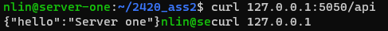

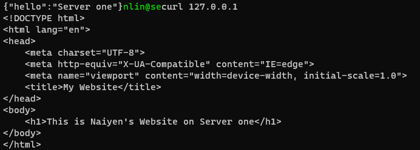

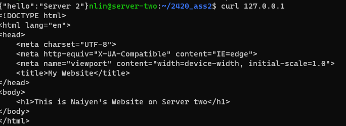

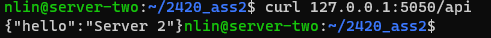


Access the webpage with browser with **ip of load balancer**.

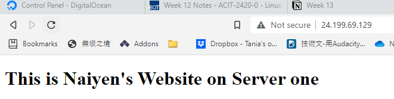

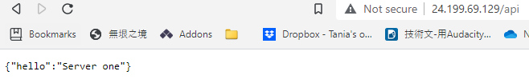

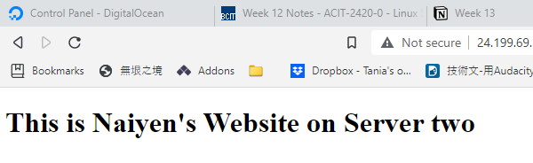

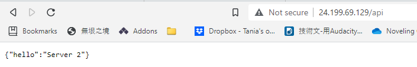


